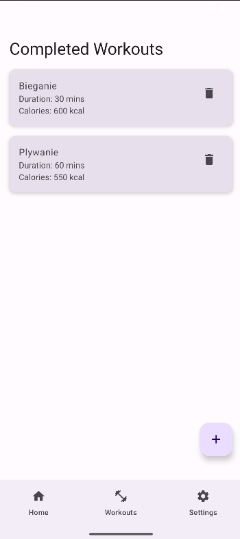

# FitTracker

## Project Description
**FitTracker** is a mobile application for Android designed to manage workouts. It allows users to schedule, add, and delete workouts, as well as receive reminders for planned activities. The app is built using modern Android technologies, including:

- **Jetpack Compose** – modern UI framework
- **Room** – local database for workout storage
- **LiveData & ViewModel** – state management
- **Android Navigation Component** – seamless navigation between screens
- **WorkManager** – handling workout reminders

## Features
- Schedule workouts by selecting a name, duration, calories burned, date, and time.
- Display a list of upcoming workouts.
- Mark workouts as completed.
- Move completed workouts to a separate list.
- Receive notifications for upcoming workouts.
- Delete workouts.

## Screenshots
### Upcoming Workouts


### Schedule a Workout


### Completed Workouts


## Technologies
- **Kotlin** – main programming language
- **Jetpack Compose** – declarative UI
- **Room Database** – local data storage
- **LiveData & ViewModel** – MVVM architecture
- **Navigation Component** – navigation management
- **WorkManager** – workout notifications

## Installation
1. Clone the repository:
   ```bash
   git clone https://github.com/OskarBelza/Fit-App
   ```
2. Open the project in **Android Studio**.
3. Run the app on an emulator or a physical device.

## Future Improvements
- Cloud synchronization for workouts.
- Integration with fitness APIs (e.g., Google Fit).
- Workout statistics analysis.
- Personalized workout goals.

## Author
- Oskar Bełza

